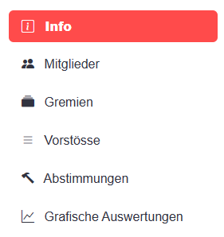

# 🏛️basel-parl-explorer (BPE)
## Description
## BPE app allows users to search, access anad anlyse political matters (motions, interpellations, petitions etc) of the parliment of Basel/Switzerland. The app is available [here](https://basel-parl-explorer.streamlit.app/). 

## Installation 
To install and run BPE locally, proceed as follows:
```
> git clone https://github.com/lcalmbach/basel-parl-explorer.git
> cd basel-parl-explorer
> py -m venv env
> env\scripts\activate
> pip intall -requirements.txt
> streamlit run app.py
```


## Project Files and Folders
- 📁 root
- `app.py`: Main program controlling the menu
- `grosser_rat.py`: Logic for all menu items
- `Procfile`: Used if published on Heroku.app
- `setup.sh`: Used if published on Heroku.app
- `requirements.txt`: Holds all dependencies

- 📁 assets
- `info_app_wide.jpg`: Image used in the info page from [Kanton Basel-Stadt Bilderdatenbank](https://www.bs.ch/bilddatenbank.html#tree=6392)
- `readme1.png`: Screenshot used in this file

- 📁 lang: Includes a language file with French and English translations for every Python module.

- 📁 utils
- `helper.py`: Various helper functions.
- `lang.py`
- `plots.py`: Functions for plotting. Most plots are generated using [Altair](https://altair-viz.github.io/index.html) or [Plotly](https://plotly.com/python/).

## Usage
The BPE application is designed to be user-friendly. The sidebar menu provides access to various features:



- **Info**: General information about the app and its data sources.
- **Members**: Information about parliament members. Click on a member for more details.
- **Committees**: Details about active and historic parliamentary committees. Click on a committee to view its details.
- **Proposals**: Information on proposals brought forward by members and committees. Click on a proposal for more details.
- **Votes**: View votes of parliament members.
- **Graphical Analyses**: Explore various graphical analyses related to the entities mentioned above.

## Acknowledgments
I would like to express my gratitude to the Parliament of Basel for providing access to data related to its activities on its [website](https://grosserrat.bs.ch/) and the open data portal [data.bs.ch](https://data.bs.ch/). Special thanks to Member of Parliament Luca Urgese and the Opendata.bs team for their valuable feedback and assistance in identifying issues within the app.

# Roadmap
The development of the BPE app will continue, with improvements and new features based on user interest and feedback. Please don't hesitate to contact the author if you have ideas for further functionality or encounter any issues. Your input is highly appreciated!
